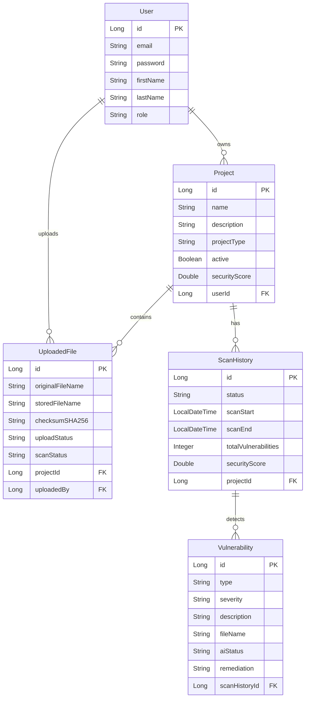

# 🛡️ SentinelAI

**An Enterprise-Grade AI-Powered Security Analysis Platform**


SentinelAI is a comprehensive, full-stack application designed to perform static source code analysis, detect hardcoded secrets, and leverage Generative AI (LLMs) to provide deep, actionable context and remediation strategies for identified vulnerabilities.

This repository serves as **Version 1.0 (MVP Release)**.

---

## ✨ Features

- **Robust Authentication:** JWT-based secure authentication with BCrypt hashing. Features complete OAuth integration (Google & GitHub), secure forgotten password reset flows, and email verification tokens with SHA-256 validation.
- **Project Management:** Organize scans into distinct projects by application type (Web, Mobile, Cloud, IoT, API).
- **Source Code Upload:** Secure `MultipartFile` upload handling with path traversal protection, extension validation, and duplicate detection via SHA-256 checksums.
- **Static Security Analysis (SAST):** Scans source code and `.zip` archives against predefined security rules using deterministic Regex matching.
- **SentinelAI Security Copilot:** Features an intent-driven interactive chat drawer that maintains persistent context (Scan ID, Language, Score, Vulnerabilities) across the application.
- **Interactive AI Enrichment:** Integrates with an LLM via RAG (Retrieval-Augmented Generation) to explain vulnerabilities, generate secure code fixes, and summarize findings. Includes real-time progress tracking UI.
- **Intelligent Retry Logic:** Built-in asynchronous retry mechanisms with exponential backoff for handling transient AI provider failures.
- **Concurrent Processing Protection:** Strict `ReentrantLock` handling prevents race conditions and duplicate scans on the same project.
- **PDF Report Generation:** Compiles comprehensive security findings into downloadable PDF reports.
- **Enterprise-Grade UI:** A premium React/Tailwind frontend featuring glassmorphism, dynamic empty states, loading indicators, and comprehensive toast notifications.

---

## 🏗️ Architecture

SentinelAI follows a modern, decoupled architecture:

- **Frontend:** React 18, Vite, Tailwind CSS, React Router, Axios.
- **Backend:** Java 21, Spring Boot 3, Spring Security (JWT), Spring Data JPA, iTextPDF.
- **Database:** MySQL 8 (Aiven Cloud).

### High-Level Data Flow

1. **Upload Phase:** User uploads source code → Validated & hashed → Stored on Disk.
2. **Scan Phase:** Async Engine runs Deterministic Rules → Flags potential vulnerabilities (Status: `PENDING`).
3. **Enrichment Phase:** Async AI Pipeline polls `PENDING` vulnerabilities → Queries LLM for context → Updates DB (Status: `COMPLETED` or `FAILED`).
4. **Reporting Phase:** Vulnerabilities aggregated → PDF Generated on-demand.

---

## 📊 Database ER Diagram



---

## 📂 Folder Structure

```
sentinel-ai/
├── frontend/                     # React Frontend App
│   ├── src/
│   │   ├── api/                  # Axios configuration and API clients
│   │   ├── components/           # Reusable UI components (Sidebar, Topbar, EmptyState)
│   │   ├── hooks/                # Custom React hooks (useAuth, useToast)
│   │   ├── pages/                # Views (Dashboard, Reports, Scanner, Projects)
│   │   └── utils/                # Formatters and helpers
│   ├── index.html
│   ├── tailwind.config.js
│   └── package.json
└── src/                          # Spring Boot Backend App
    ├── main/
    │   ├── java/com/sanjay/aisecurity/
    │   │   ├── config/           # Security, Swagger, Async, AI Configs
    │   │   ├── controller/       # REST API Endpoints
    │   │   ├── dto/              # Request/Response Data Transfer Objects
    │   │   ├── entity/           # JPA Entities (User, Project, ScanHistory)
    │   │   ├── enums/            # AiStatus, ScanStatus, Severity
    │   │   ├── exception/        # Global Exception Handlers
    │   │   ├── repository/       # Spring Data JPA Repositories
    │   │   ├── service/          # Core Business Logic (Upload, Scan, AI)
    │   │   └── util/             # Helpers (SecurityUtils)
    │   └── resources/
    │       ├── application.yml
    │       ├── application-dev.yml
    │       └── aiven-truststore.jks
    └── pom.xml
```

---

## 🚀 Installation & Setup

### Prerequisites
- **Java 21** or higher
- **Node.js 20+**
- **Maven**
- **MySQL 8** (or use the configured Aiven Cloud DB credentials)
- **Google Gemini API Key**

### Backend Setup
1. Open the project root in your terminal.
2. Set your environment variables:
   ```bash
   export DB_USERNAME=your_username
   export DB_PASSWORD=your_password
   export GEMINI_API_KEY=your_gemini_api_key
   ```
3. Run the backend application:
   ```bash
   mvn clean spring-boot:run
   ```
   *The backend will start on `http://localhost:8081`.*

### Frontend Setup
1. Open a new terminal and navigate to the frontend directory:
   ```bash
   cd frontend
   ```
2. Install dependencies:
   ```bash
   npm install
   ```
3. Start the development server:
   ```bash
   npm run dev
   ```
   *The frontend will be available at `http://localhost:3000`.*

---

## 📚 API Documentation

Once the backend is running, the interactive Swagger UI documentation is available at:
👉 `http://localhost:8081/swagger-ui/index.html`

### Key Endpoints:
- `POST /api/v1/auth/login` - Authenticate and receive JWT.
- `POST /api/v1/projects` - Create a new project workspace.
- `POST /api/v1/projects/{id}/files` - Upload source code.
- `POST /api/v1/scans/{projectId}` - Trigger a static analysis scan.
- `POST /api/v1/ai/enrich/{scanId}/all` - Trigger AI enrichment for a scan.
- `GET /api/v1/reports/pdf/{scanId}` - Download PDF report.

---

## 🗺️ Roadmap (Version 1.1+)

While Version 1.0 is stable and feature-complete for its MVP scope, the following improvements are planned for future releases:

1. **Distributed Locking (High Priority):** Transition from JVM `ReentrantLock` to Redis-based distributed locks to support multi-node horizontal scaling.
2. **Soft-Delete Disk Cleanup (Medium):** Implement a scheduled background job (`@Scheduled`) to physically delete files from the disk 30 days after they are soft-deleted from the database.
3. **SCA & Dependency Analysis:** Integrate Software Composition Analysis to detect vulnerabilities in `pom.xml`, `package.json`, and `requirements.txt`.
4. **Taint Analysis (Data Flow):** Enhance the static analysis engine to track untrusted user input from controllers down to database queries.

---

*Engineered by Sanjay. Built with Spring Boot & React.*
